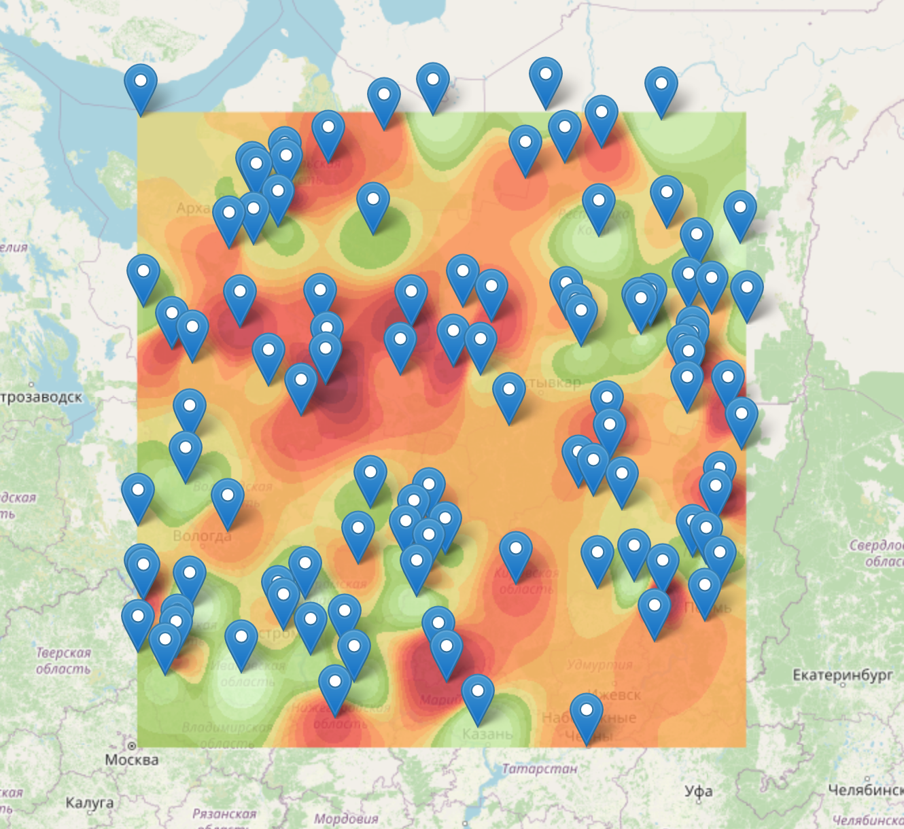

# leaflet.heatmap

GL-based heatmap plugin for [Leaflet](https://leafletjs.com/). Allows you to visualize a heat map of huge arrays of points with WebGL.



## Install

```bash
npm install leaflet.glheatmap
```
```bash
npm install leaflet
```

## Example

```js
import L from 'leaflet';
import 'leaflet/dist/leaflet.css';
import heatmap from 'leaflet.glheatmap';

const map = L.map('map').setView([55.75, 37.61], 10);
L.tileLayer('https://{s}.tile.openstreetmap.org/{z}/{x}/{y}.png', {
  attribution: '&copy; OpenStreetMap'
}).addTo(map);

// Пример точек
const points = Array.from({ length: 100 }, () => [55.7 + Math.random() * 0.1, 37.55 + Math.random() * 0.1, Math.floor(Math.random() * 30)]);

// Прямоугольный полигон
const lats = points.map(p => p[0]);
const lngs = points.map(p => p[1]);
const minLat = Math.min(...lats);
const maxLat = Math.max(...lats);
const minLng = Math.min(...lngs);
const maxLng = Math.max(...lngs);
const polygon = [[minLat, minLng], [minLat, maxLng], [maxLat, maxLng], [maxLat, minLng], [minLat, minLng]];

heatmap(points, { polygon: [polygon] }).addTo(map);
map.fitBounds(L.polygon(polygon).getBounds());
points.forEach(([lat, lng, value]) => L.marker([lat, lng]).bindPopup(`Value: ${value}`).addTo(map));
```

## Lecense

MIT © Nikolay Alekseev